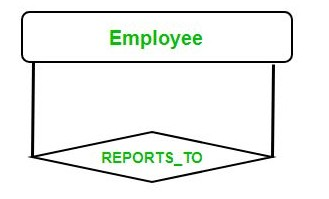

# Entity Relationship Model

## Introduction to ER Model

It consists of three components - entity, entity type and entity set.

### Entity
Akin to an object of a class. It is represented by variable.

 

### Entity Type
Akin to class. It is represented by rectangle with the entity type name inside the rectangle.

 

### Entity set
As evident by the name, it is basically set of entities of a particular entity type. It represented by an vertical oval with variable names inside it.

 

### Attributes
Akin to properties in a class. They are represented in an horizontal-oval with its name inside it.

There are four types of attributes - 

#### Key Attribute
Akin to primary key. Represented with an underline below its name inside oval.
#### Composite attribute
Akin to object attribute have many attributes inside it. Represented by attributes sticking out of composite attribute oval.
#### Multivalued attribute
Akin to vector in c++. Can store multiple values and are represented by double oval outline
#### Derived attribute
Akin to local variables which are derived from state variables in a flutter widget. Represented by dashed oval border

 

### Relationships

These are the relations between entity types(i.e. between class definitions). These are represented as a diamond with relation ship name inside it with two outward lines connecting two entity types in context.

#### Degree of relationship set 
This is the number of  **different** entity types participating the relationship. There are three types -
+ Unary(eg married To between persons)
+ Binary(eg married to between a man and woman)
+ N-ary

#### Cardinality
This is the number of times an entity can participate. It can be at most once or more than once. The types are as - 
+ One to one : for eg male married to female
+ Many to one/one to many : People with religion
+ Many to many : Students with course

This is represented by numbers beside the line connecting the entity type with relation. Let the number be x, then x => that x entity can have same relation.

#### Participation constraints

These are the constraints applied on the entity set participating in the relationship.

##### Total participation
=> Each entity in the set **must** participate in the relationship. This is depicted by double parallel lines joining the entity type with relation diamond.

##### Partial participation
=> Each entity in the set **may or may not** participate in the relationship. This is depicted by single parallel lines joining the entity type with relation diamond.

#### Weak Entity type
These are the entity type which do not have a primary key, have no independent existence and are always dependent on an **identifying type**. These are represented by double outline rectangle with weak entity name inside it.

#### Identifying Relationship
These are the relationships which identify the weak entities and shows their dependency on identifying entity type. They required total participation of weak entity set and are depicted by double outline diamond.

 

---
 

## Enhanced ER model

Apart from the regular ER model, here concepts like subclass, superclass, union, aggregation, etc are introduced.

### Generalisation and specialisation

These are just like for super class(i.e. general class) and subclass (i.e. specialised class). In the diagram these are shown just like how composite attributes are shown, i.e. with main entity type rooting many sub/derived entity types with arrow line.

 

### Constraints on subclass relationship

#### Total or partial
A sub-classing relationship is total if every entity of the super class is associated with some subclass. Whereas in partial relationship, its not necessary for a super class entity to be a part of a subclass.

#### Overlapped or disjoint
A sub-classing relationship is called overlapped if some superclass entity is part for more than subclass whereas disjoint no entity is part of more than one subclass.

> These two relationships are independent of each other

 

### Multiple inheritance
Just like how a faculty can be subclass of both an employee as well as alumni.

 

### Union

Its represented just like branch structure with a circle with an `U` written inside it. The union entity type's branch has a `U` mark in between with open ends pointing to the union node.

Union -> RC = union of vehicle and carModel
Subclass -> car model and truck are inherited from vehicle

 

---

 

## Minimisation of ER Diagrams

This section is all about how can we minimise the number of data tables given the cardinality of relations between them.

### One to many relationship

Let us have three tables with two being informational and the third one being stating relationship between he two, then we can clearly reduce one table and join an relationship table with the one having primary key in the relationship table also. Thus, **Two** tables are required minimum.

 

### Many to many

Let us have the same scenario as above, but since this is many to many hence there will not be a primary key in the relation table, hence **Three** tables will be required at minimum.

 

### One to one

Here, there are two cases,i.e when the relation has total participation at at-least one end and when partial participation at both ends.

#### Total participation at at-least one end
If this is the case the we can completely display all the data in a **single** table.

#### No total participation
Then we cannot merge the two tables completely hence there will be a minimum of **Two** tables required.

 

---

 

## Generalisation, Specialisation and Aggregation
These are used in data abstraction.

 

### Generalisation
> This is a **Bottom-up Approach**

This is the process of extracting common set of properties from a bunch of entities and create a more generalised version of those. For eg, from STUDENT and FACULTY , we can create a more generalised entity PERSON.

 

### Specialisation
> This is a **Top-down Approach**

This is the process of subdividing an entity into sub-entities based of their specific characteristics. For eg, we can subdivide EMPLOYEE into DEVELOPER, MANAGER, etc.

 

### Aggregation
> Represent relationships as higher level entity sets

Since ER diagram is not capable of representing relationship between an entity and a *relationship*(Comprising of entities and in-between relation), therefore for such cases, we aggregate the components of the *relationship* and create/treat it as a new higher level entity. For eg, EMPLOYEE is working in a PROJECT and this specific combination requires a machine, so - 

 

---

 

## Recursive relationships in ER Diagrams
 

Its a relationship where the entities in subject are same. They take part in the same relationship with different role in each instance. For eg, EMPLOYEE, its recursive relationship can be REPORTS_TO. Thus each employee **can** (CEO cannot get supervised and noobs cannot supervise) play role as - 
1) Supervisor
2) Subordinates

 

### Cardinality observation

+ Supervisor of
    + Max = N
    + Min = ZERO
+ Subordinate of
    + Max = 1
    + Min = 0

 

---

 

## Impedance mismatch in DBMS
 

This is the phenomena of problems due to differences between the database model and the programming language model(incase when we use a general purpose programming language for communicating with the database management system)

The problems which arise in the following categories-

#### Data-types of the attributes
The data-type may differ between different programming languages and the data type in the data model. So matching and interpolating between data type of data model to the data types available in the programming languages(like Java, C, C++ ...) becomes a necessity.

#### Data access in tables
Since results of queries in data base are tuples or set of tuples, so proper binding to map the query result data structure to an appropriate data structure in the programming language becomes necessity.

> Impedance mismatch is much less of a problem incase of a special database programming language designed specifically for it. For eg, SQL

---

