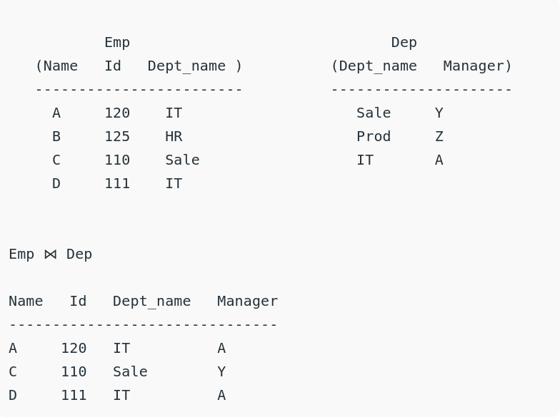

# Relational Algebra

## Introduction to relational algebra in DBMS
 

Basically......function(relation) to relation. The following are the basic relational operators - 

### Projection

Symbol - (pie) =>  π 

This is used to project / select required column data from a relation(Table). By default, this operator removes redundant copies of same data after applyling the operation.

Usage : π (column_name1 column_name2) relation_name 

 

### Selection

Symbol - (sigma) => σ

This is user to select required tuple(rows) from the relation. To display the data, projection operator is required.

Usage : π( σ(<condition like (column_name > value)>) ) Relation_name

 

### Union

Symbol - (capital u) => U

This operator take the union of the value to two relations. **The relations must have same attributes** It takes all the distinct tuples from the two relations

 

### Set Difference

Symbol - (minus) => -

This works just like set difference incase of sets, the tuples not present in other relation are taken up from current relation.

 

### Rename

Symbol - (rho) => ρ

This allows us to rename attributes in relations.

Usage : ρ(new_attribute_name / old_attribute_name) Relation_name

 

### Cross Product

Symbol - (cross) => X

Cross Product between two relations (let them be `A` with `n` entries & `B` with `m` entries) will be new relation (`Z` with `n*m` entries) such that for each tuple of relation `A` , there will be `m` entries of relation `B` i.e common tuple `A` +  tuples of B.

 

### Natural join

Symbol - (outlined infinite) => ⋈

This is a binary operator which joins two or more relations such that the result sets are combination of tuples where they have equal common attributes.

### Conditional Join

Works same as natural join by instead of by default having same common attribute value, here we can specify conditions for creating sets . Having a common attribute is not required here.

 

---
 

## 

