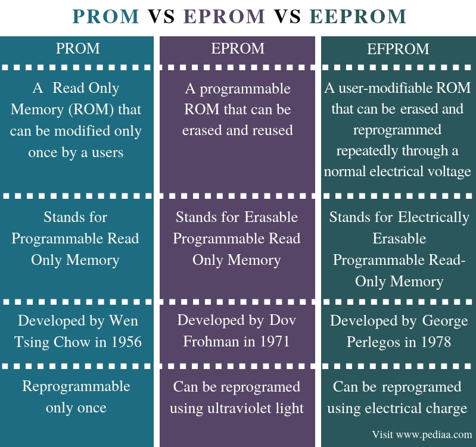
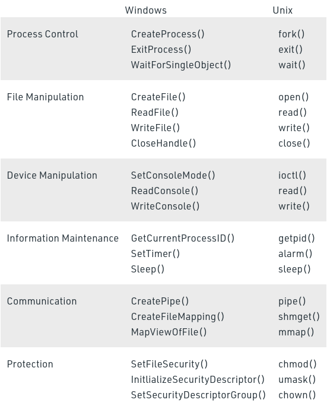

# Overview

OS is the intermediary between computer hardware and user of the computer. The purpose of OS is to provide an environment for users to execute programs conveniently and efficiently.

## Services provided by OS
 

**Program Execution :**
 

**Handling I/O operations :**
 

**Manipulation of file system :**
 

**Error Detection and handling :**
 

**Resource Allocation :**
 

**Accounting** (or logging) : 
 

**Information and resource protection :**

 

---
 

## Types of OS
 
Not understood clearly, check [this](https://www.geeksforgeeks.org/types-of-operating-systems/) and some youtube tutorial

### Batch OS

In this, there is an intermediate operator which sorts and groups similar jobs into batches before their processing by the CPU.

 

### Time-Sharing OS aka multitasking systems

Each task of same/different user is given some time to execute. Each users uses the CPU as a single user for their share of allotted time. The time that each task gets to execute is called quantum.

EG : Unix

 

### Distributed OS aka loosely coupled systems

Here various independent units posses their own memory and CPU and communicate with each other via a shared communication network(central OS type). Major benefit ?  A user can access resource not present in its unit.

EG : LOCUS

 

### Network OS aka tightly coupled systems

> As each user within network knows all other users configuration compared to independence in distributed os

Here a central server manages data, users, groups, security, applications and other networking functions within the network. These types os OS allows shared access to files, printers, security, applications and other networking functions over a small private network.

EG : Windows server 2008

 

### Real-time OS

These OS serve realtime systems where the time interval required to process and respond to inputs are very small(ie, response time is very small)

+ Hard real-time systems : Where time constrains are too strict eg : airbag system.
+ Soft real-time systems : less strict

EG : weapon systems, medical imaging systems

 

---
 

> SRAM is faster than DRAM, hence used to L2 and L# cache. [full article](https://www.guru99.com/sram-vs-dram-difference.html)

 

> </img>

 

> Virtualisation vs Containerization,  => Hardware level virtualisation vs os-level virtualisation   [full article](https://www.tutorialspoint.com/difference-between-virtualization-and-containerization)

 

> BIOS vs UEFI   => Basic I/O sys. vs Unified extended firmware interface. => Slow, less hardware driver support, less memory support(max 2.1 TB) vs fast, more support, fast boot times, very large memory support(max 9.1 Zeta byte)  See full article [here](https://www.howtogeek.com/56958/htg-explains-how-uefi-will-replace-the-bios/)

 

> MBR vs GPT => Master boot record vs GUID partition table => Old, limited space(2TB max), up to 4 primary partitions vs Modern, very large limit, unlimited partitions, very large nearly unique identifying strings for each partition  See full article [here](https://www.howtogeek.com/193669/whats-the-difference-between-gpt-and-mbr-when-partitioning-a-drive/)

 

---
 

## Important terms to know
 

### Compiler and Interpreter
Converts converts high level language to low level assembly language in one scoop or one line at a time respectively

### Assembler
Converts the assembly code into machine code

### Linker
Links all the different part of the program together for execution by creating an executable machine code.

### Loader
Loads the executable machine code into memory to be executed.

### System call
System call is programmatic way for applications to requests services from the kernel of the OS

 

</img>

### Kernel
Its the central component of an OS which manages the operations of memory and CPU time. Interfaces between hardware and software processes.

### Application program interface
An application program interface (API) is code that allows two software programs to communicate with each other

### Shell
A shell is special user program which provide an interface to user to use operating system services

### JVM
It is a specification that provides runtime environment in which java bytecode can be executed. Java bytecode is a assembly language of java