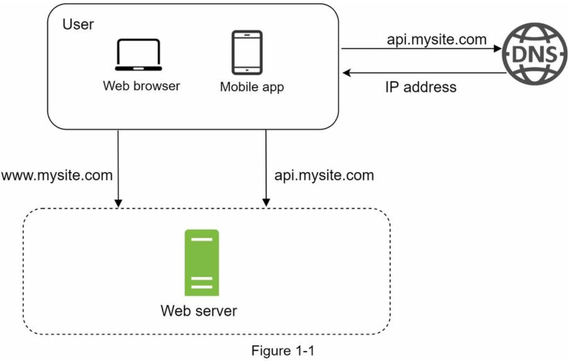
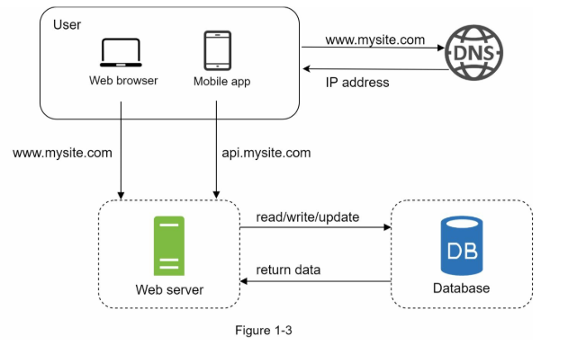
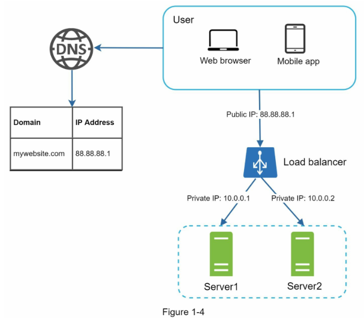
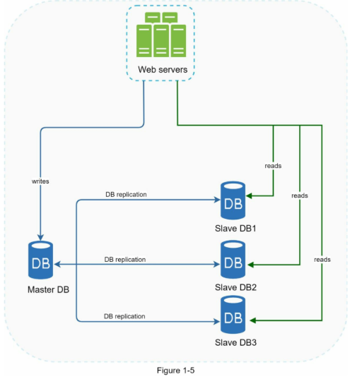
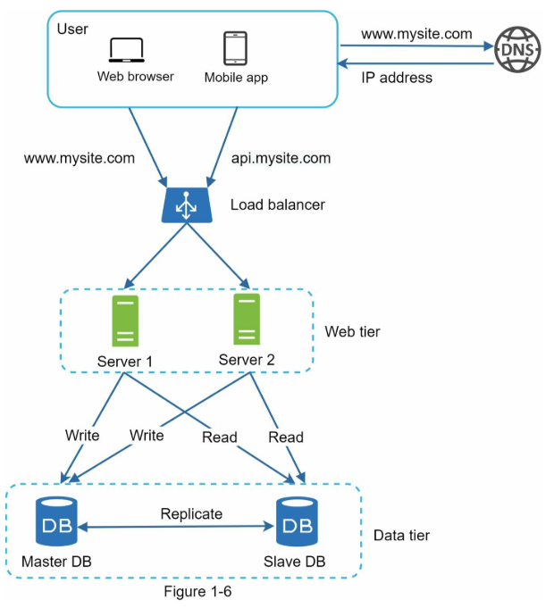
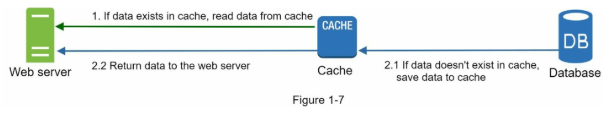
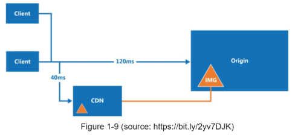
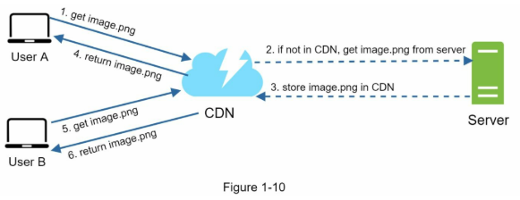
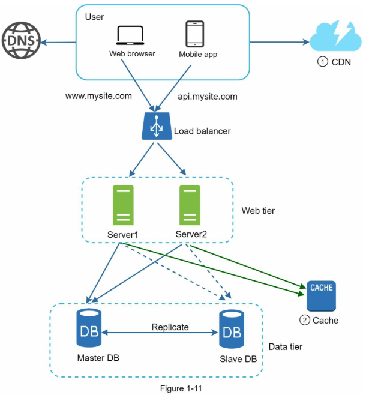

*System Design Interview: V1C1*
# Scalling from Zero to Millions of Users

This would be a journey to scalling a generic application from scratch to a million users.

## Single Server Setup

Start with everything running in a single server (web app, database, cache, etc)

- [DNS](DNS.md) is a paid service by 3rd parties
  - For a domain name, this returns the ip address.
- Traffic sources
  - Web application
  - Mobile Application
- Generally http protocal is used between mobile app and web server. **Need to verify.**
- JSON is a commonly used API response. Another is Protocolumn buffers used with gRPC.

---

*Growth happened, one server isn't enough, so we separate the web server and the Database.*

---

## Separating Database and Webserver

Separating them allows the decoupled parts to scale independently.

### Which database

*We can either use a relational database (these are also called RDBMS) or non-relational database
called as NoSql databases*

*SQL databases store the data in tables and rows. You can perform joins using SQL across different tables.*

> NoSql databases can be groped into four catgories:
> - Key Value stores
> - Graph stores
> - Column stores
> - Document stores

*Generally joins are not supported by NoSql databases.*

**Now**, relational database is the best option for most of the use cases unless:
- Application requires super low latency
- Unstuctured data / **non relational data**
- Massive amount of data

---

Now we need to actually scale. See [Scaling](Scaling.md) for more pointers.

---

## Scaling after decoupling the web server and database

We'll add more web servers and create a pool of web servers. Since there are more than one server,
it makes sense to evenly distribute the incoming traffic using a **Load Balancer** (load balancer can become a SPOF, see [here](HarwardScalabilityLectureNotes.md#load-balancing))

- Users are exposed to the public IP of the load balancer via the DNS.
- Private IPs are for communication between servers.
- If some server fails, traffic is redistributes between the other servers
- More server can be added gracefully when load increases.

**Now our web tier supports failover and redundancy.**

---

*Database still is a SPOF...*

---

## Failover and redundancy in database

This can be solved with database replication.

See [Database Replication](DatabaseReplication.md)

Let's employ Master Slave configuration! (even if master fails, slave
will take over).

So not incorporating this into our system, it becomes

---

*Now our web as well as the data tier have employed failover
strategies and have become reliant and available. Now lets try to
improve the latency / response time.*

---

## Improving Latency / Response time

This can be done:
- Using a **cache** layer between web and data tier.
- Storing static content in **CDN**.

Cache stores the result of expesive responses or frequently accessed data in the memory.

### Cache Tier

This is a temporary data store layer which is much faster than database.
Having a separate cache tier:

- Improves system performance
- Decreases load on database
- Allows independent scaling of the cache tier

### Read through cache strategy

Is a simple strategy where we the request follow the following flow:

### Considerations for using cache

- Data should be access frequently, but modified infrequently.
- Proper expiration policy should be in place.
  - It shouldn't be too short or data would be refreshed frequenly from the db
  - It shouldn't be too long because then data would be stale.
  - Cache Invadidation is a very interesting and challenging problem in CS.
- Consistency, cache should be in sync with the db after modification of the data.
  - This is especially challenging when scaling across multiple regions
- Proper failover strategies and servers
- Eviction Policy, when cache is full, we need to follow some eviction policy like
  FIFO, LRU, LFU, etc.

### CDN: Content Delivery Network

- 3rd party geo dispersed service.
- Used to cache static content like, images, videos, CSS, JS, etc.
- *There is something like dynamic caching also but we can study that later [TODO]*
- Decreases the fetching latency owing to proxity to the users

The interaction between the user, CDN and the webserver happens as follows

*One important point is that webserver can optionally return the HTTP header `Time-To-Live`, which describes how long the resource can be cached*

> **Question**: What is CDN alter the request and get's access to the data?  
**Answer**: While this hypothetical scenario is a valid one but there are several safeguards present to mitigate this.
> - **Encryption**: Most of the modern websites used HTTPS which is completely encrypted in transit.
> - **Robust Auth Mechanisms**: Web servers can detect if a request is modified.
> - **CDN reputation and security**: They take this very seriously

> CDN can also safeguard from DDOS (Distributed denial of service) attacks

#### Considerations of using CDN

- Cost: Caching infrequently accessed content doesn't makes any sense.
- Setting appropriate cache expiry!
- CDN fallback: You should consider the failover strategy when a CDN fails, clients
  should be able to detect this and request directly from origin.
- File Invalidations: We can invalidate a file before expiry time by:
  - Invoking CDN APIs
  - Object versioning. For eg: `image.png?v=2`

Now our system looks like this:

